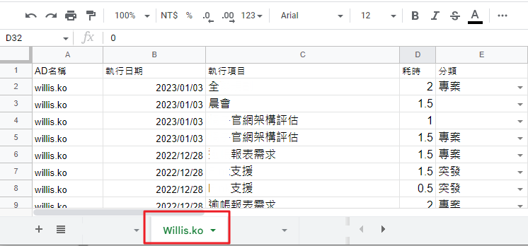

##  設定教學

Toggl.ini

```ini
[Section_A]
; google sheet name [要修改]
USERNAME = <your name>

; toggl token api [要修改]
TOGGL_TOKEN = <input your token>

; google sheetkey
SHEETKEY = <1sV1IH0lxNTUkMLDLwwcQ11234566789-ruXyw6vdf-hI>

; google sheet api file path 
AUTH_JSON_PATH = <json file path>

; 固定
GSS_SCOPES = https://spreadsheets.google.com/feeds
```

### USERNAME 位置

範例:Willis.ko



TogglSyncGoogleSheet會抓取Profile的WORKSPACE NAME設定的值，寫入GoogleSheet

`setting --> WORKSPACE NAME 改成你自己的英文名稱`

  

### TOGGL_TOKEN

**申請帳號**

1. 進入 [網站](https://toggl.com/track/login/) 申請帳號後，進入 [Profile](https://track.toggl.com/profile)
2. 取得 TOGGL_TOKEN 。 ex:abcdefghijk739c94ebbfb73041234


### Google sheetkey

建立完成一個Google Sheet後連結內的
`https://docs.google.com/spreadsheets/d/<yoursheetkey>/edit#gid=485777743`


### 申請google api

(待補) 