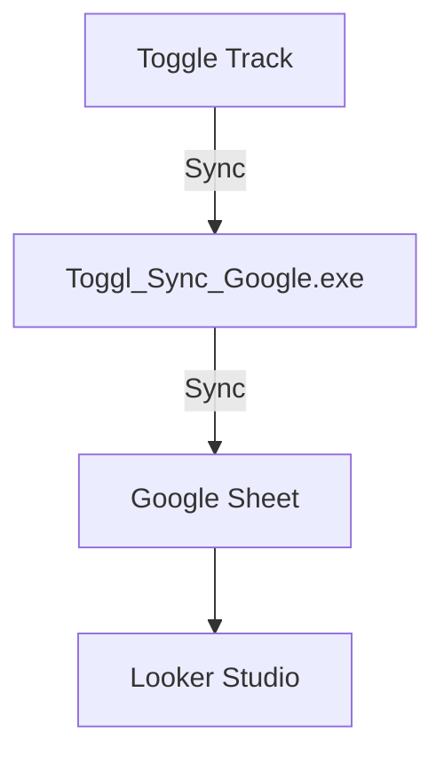
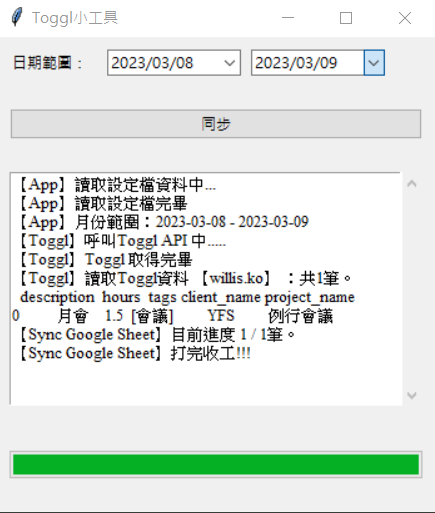
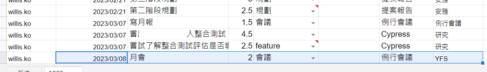

<h1 align="center">Welcome to Toggl_Sync_GoogleSheet 👋</h1>

  <a href="https://github.com/2850/Toggl_Sync_GoogleSheet#readme" target="_blank">
    
  </a>
  <a href="https://twitter.com/ke_wei88283" target="_blank">
    
  </a>

> 如果你跟我一樣有以下問題，那開始做工作記錄吧

啟發來自[[最有生產力的一年]]第四章【善用生理黃金時段】記錄自己的工作狀況

**自己角度**

1. 完成很多事情，被主管詢問時卻說不上來做了哪些事情
2. 週報、月報總是沒有素材可以寫，太小的事情又不想寫，但有多大的進展也沒有
3. 下班回家總是心靈上空虛，覺得自己還可以再更好
4. 忙到自願加班事情還是做不完，跟上層反應不是聽不懂、就是無法說服對方

## 工作原理解釋

- [Toggl Track](https://toggl.com/track/login/) 很方便記錄工作Log的軟體，他開放API讓使用者撈取自己的工作紀錄。[連結](https://toggl.com/track/pricing/)
- [Google 試算表](https://www.google.com/sheets/about/) 資料停靠站用來方便統計工作狀況，他也有提供API 讓開發者可以存取
- [Looker Studio](https://lookerstudio.google.com/) 視覺化報表跟Google Sheet有很好的整合，是我的最終目的。

**流程如下**

## DEMO

待補

## TogglSyncGoogle 使用方法

1. 請跟著[設定教學](doc/setting.md)
2. 點選 Toggl_Sync_Google.exe
3. 選擇想要的從Toggl Track 同步到google sheet 日期區間
1. 注意：結束日期 +1 Day才會是你想要的日期，例如想要同步3/8~3/10，請選擇3/11
2. 系統會以30分鐘為基準，>30 分鐘 以一小時計算，< 30分鐘不列入計算
3. 確保每個任務設定 Client、Project、Tag，否則無法同步成功
4. 按下同步按鈕同步成功。

  

同步成功

  

### 🏠 [Homepage](https://github.com/2850/Toggl_Sync_GoogleSheet#readme)

### ✨ [Demo](https://github.com/2850/Toggl_Sync_GoogleSheet#readme)

## Todo List

- [ ] googlesheet申請步驟
- [ ] 確認macOS可以順利執行

## Author

👤 **Willis.Ko**

- Website: <https://willis-note.vercel.app/>
- Twitter: [@ke\_wei88283](https://twitter.com/ke\_wei88283)
- Github: [@2850](https://github.com/2850)

## Show your support

Give a ⭐️ if this project helped you!
***

_This README was generated with ❤️ by [readme-md-generator](https://github.com/kefranabg/readme-md-generator)_
