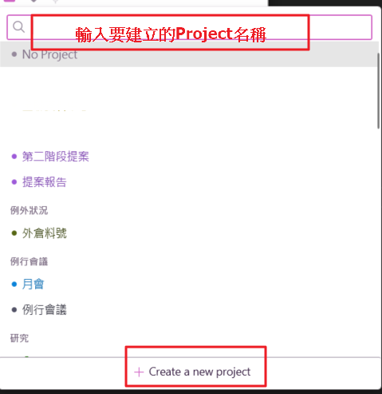

## 開發初衷與痛點

```ad-tip
title: 靈感
啟發來自[[最有生產力的一年]]
```

如果你跟我一樣有以下問題，那開始記錄工作狀況吧

```ad-info
title: 資訊
這是一個懶惰的工程師又想要打臉上層錯誤決策的產物
```

**管理者角度**

1. 月報整理部門產出時，讓其他部門了解功能開發時數
2. 接收新任務可根據過往時數預估可完成時間
3. 下屬工作很努力，但產出無法出來，時間是否花在有價值的地方上
4. 沒有一個好的免費管理工具來協助下屬紀錄工作狀況

```ad-tip
title: 建議
Toggl Track是很好的時間管理工具，個人版本免費，付費版本功能非常完善，建議大家去體驗並購買。[連結](https://toggl.com/track/pricing/)
```

**員工角度**
1. 感覺完成很多事情，被主管詢問時卻說不上來做了哪些事情
2. 週報、月報總是沒有素材可以寫，太小的事情又不想寫，但有多大的進展也沒有
3. 下班回家總是心靈上空虛，覺得自己還可以再更好
4. 忙到自願加班事情還是做不完，跟上層反應不是聽不懂、就是無法說服對方

## 工作原理解釋

- [Toggl Track](https://toggl.com/track/login/) 是很方便記錄工作Log的軟體，他開放API讓使用者撈取自己的工作紀錄
-  [Google 試算表](https://www.google.com/sheets/about/) 是我們最終目的，他也有提供API 讓開發者可以存取
- [Looker Studio](https://lookerstudio.google.com/) 視覺化報表跟Google Sheet有很好的整合

**流程如下**


## DEMO

待補

##  設定

Toggl.ini

```ini
[Section_A]
; google sheet name [要修改]
USERNAME = <your name>

; toggl token api [要修改]
TOGGL_TOKEN = <input your token>

; google sheetkey
SHEETKEY = <1sV1IH0lxNTUkMLDLwwcQ11234566789-ruXyw6vdf-hI>

; google sheet api file path 
AUTH_JSON_PATH = <json file path>

; 固定
GSS_SCOPES = https://spreadsheets.google.com/feeds
```

### USERNAME 位置

範例:Willis.ko


TogglSyncGoogleSheet會抓取Profile的WORKSPACE NAME設定的值，寫入GoogleSheet

`setting --> WORKSPACE NAME 改成你自己的英文名稱`

  


### TOGGL_TOKEN

**申請帳號**

1. 進入 [網站](https://toggl.com/track/login/) 申請帳號後，進入 [Profile](https://track.toggl.com/profile)
2. 取得 TOGGL_TOKEN 。 ex:abcdefghijk739c94ebbfb73041234


### Google sheetkey

建立完成一個Google Sheet後連結內的
`https://docs.google.com/spreadsheets/d/<yoursheetkey>/edit#gid=485777743`


### 申請google api

(待補)

## TogglSyncGoogle 使用方法

1. 點選 Toggl_Sync_Google.exe
2. 選擇想要的從Toggl Track 同步到google sheet 日期區間
`(注意：結束日期 +1 Day才會是你想要的日期，例如想要同步3/8~3/10，請選擇3/11)`
3. 按下同步按鈕

  

同步成功

  

    確保每個任務設定 Client、Project、Tag，否則無法同步成功


## Toggl Track 建立 Client、Project 

### Client、Project、tag 定義

```ad-info
title: 資訊
建議：有使用再新增，建議APP比較直覺

Client : 比較大且長期的專案或是範圍

Project : 針對Client項目對任務的展開
```

案例一


範例二


Client、Project、Tag 同步google Sheet 的位置分佈


### 建立方法 (App)：

#### 建立Client

透過建立Project介面建立client
開啟要記錄的工作，最下面【Create a new Project】

  

  

#### 建立Project

  


### 建立方法(Web)：

1. 在web toggl 網站先定義與google 表單對應好網站/系統、標籤、分類欄位

  

選擇Client 、 Proejct 建立想要的對應

  